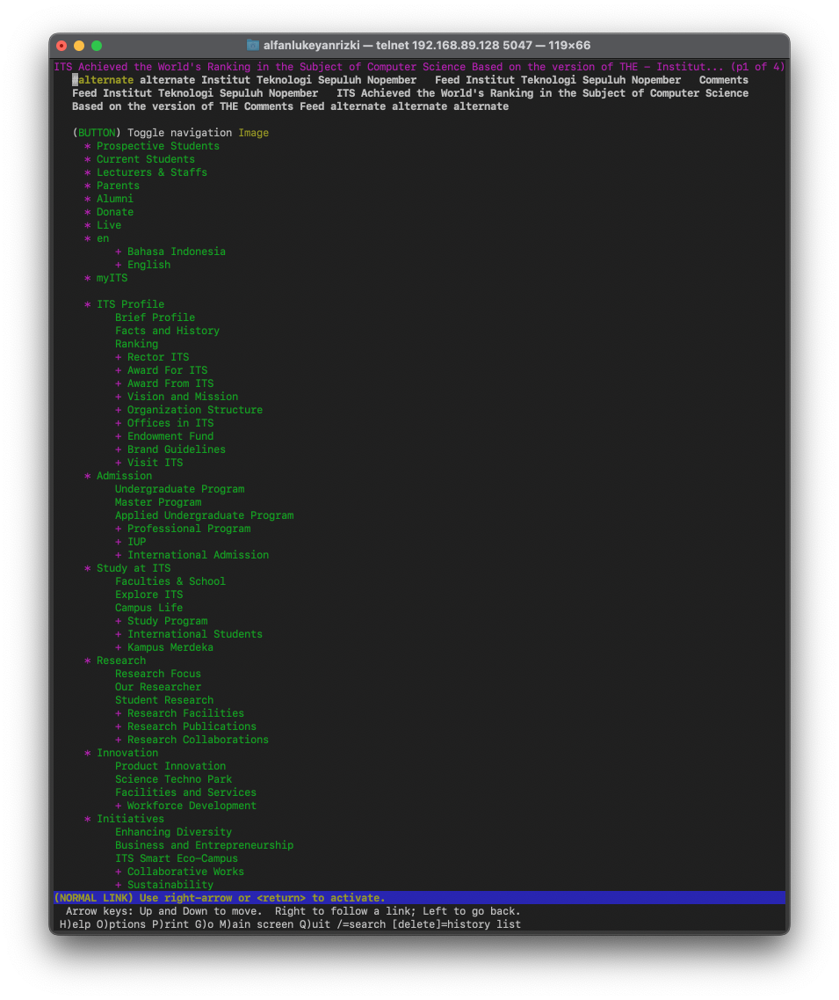
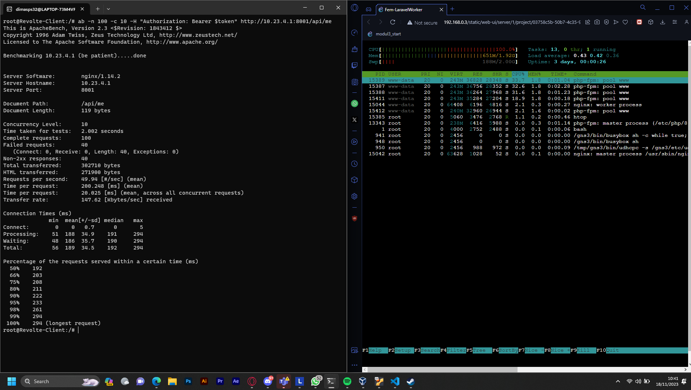

# Praktikum Modul 3 Jaringan Komputer

Perkenalkan kami dari kelas `Jaringan Komputer D Kelompok D03`, dengan anggota sebagai berikut:

| Nama                   | NRP        |
| ---------------------- | ---------- |
| Alfan Lukeyan Rizki    | 5025211046 |
| Dimas Prihady Setyawan | 5025211184 |

## Daftar Isi

- [Official Report](#laporan-resmi)
  - [Menu](#daftar-isi)
  - [Topology](#topology)
  - [Node Config](#config)
  - [Prerequisite](#prerequisite)
- [Question 1 - DHCP](#Soal-1)
  - [Script Solution](#script)
  - [Test Result](#result)
- [Question 2 - DHCP](#Soal-2)
  - [Script Solution](#script-1)
  - [Test Result](#result-1)
- [Question 3 - DHCP](#Soal-3)
  - [Script Solution](#script-2)
  - [Test Result](#result-2)
- [Question 4 - DHCP](#Soal-4)
  - [Script Solution](#script-3)
  - [Test Result](#result-3)
- [Question 5 - DHCP](#Soal-5)
  - [Script Solution](#script-4)
  - [Test Result](#result-4)
- [Question 6 - Reverse Proxy](#Soal-6)
  - [Script Solution](#script-5)
  - [Test Result](#result-5)
- [Question 7 - Reverse Proxy](#Soal-7)
  - [Script Solution](#script-6)
  - [Test Result](#result-6)
- [Question 8 - Reverse Proxy](#Soal-8)
  - [Script Solution](#script-7)
  - [Test Result](#result-7)
- [Question 9 - Reverse Proxy](#Soal-9)
  - [Script Solution](#script-8)
  - [Test Result](#result-8)
- [Question 10 - Reverse Proxy](#Soal-10)
  - [Script Solution](#script-9)
  - [Test Result](#result-9)
- [Question 11 - Reverse Proxy](#Soal-11)
  - [Script Solution](#script-10)
  - [Test Result](#result-10)
- [Question 12 - Reverse Proxy](#Soal-12)
  - [Script Solution](#script-11)
  - [Test Result](#result-11)
- [Question 13 - Implementasi Laravel](#Soal-13)
  - [Script Solution](#script-12)
  - [Test Result](#result-12)
- [Question 14 - Implementasi Laravel](#Soal-14)
  - [Script Solution](#script-13)
  - [Test Result](#result-13)
- [Question 15 - Implementasi Laravel](#Soal-15)
  - [Script Solution](#script-14)
  - [Test Result](#result-14)
- [Question 16 - Implementasi Laravel](#Soal-16)
  - [Script Solution](#script-15)
  - [Test Result](#result-15)
- [Question 17 - Implementasi Laravel](#Soal-17)
  - [Script Solution](#script-16)
  - [Test Result](#result-16)
- [Question 18 - Implementasi Laravel](#Soal-18)
  - [Script Solution](#script-17)
  - [Test Result](#result-17)
- [Question 19 - Implementasi Laravel](#Soal-19)
  - [Script Solution](#script-18)
  - [Test Result](#result-18)
- [Question 20 - Implementasi Laravel](#Soal-20)
  - [Script Solution](#script-19)
  - [Test Result](#result-19)

### Topology


### Config

- Router
    - Aura (DHCP Relay)
    ```
    auto eth0
    iface eth0 inet dhcp

    auto eth1
    iface eth1 inet static
        address 10.23.1.1
        netmask 255.255.255.0

    auto eth2
    iface eth2 inet static
        address 10.23.2.1
        netmask 255.255.255.0

    auto eth3
    iface eth3 inet static
        address 10.23.3.0
        netmask 255.255.255.0

    auto eth4
    iface eth4 inet static
        address 10.23.4.0
        netmask 255.255.255.0
    ```
    
- Switch 1
    - Himmel (DHCP Server)
    ```
    auto eth0
    iface eth0 inet static
        address 10.23.1.2
        netmask 255.255.255.0
        gateway 10.23.1.1
    ```
    - Helter (DNS Server)
    ```
    auto eth0
    iface eth0 inet static
        address 10.23.1.3
        netmask 255.255.255.0
        gateway 10.23.1.1
    ```
- Switch 2
    - Denken (Database Server)
    ```
    auto eth0
    iface eth0 inet static
        address 10.23.2.2
        netmask 255.255.255.0
        gateway 10.23.2.1
    ```
    - Eisen (Load Balancer)
    ```
    auto eth0
    iface eth0 inet static
        address 10.23.2.3
        netmask 255.255.255.0
        gateway 10.23.2.1
    ```
- Switch 3
    - Lugner (PHP Worker)
    ```
    auto eth0
    iface eth0 inet dhcp
    hwaddress ether 62:4f:02:e4:b9:d9
    ```
    - Linie (PHP Worker)
    ```
    auto eth0
    iface eth0 inet dhcp
    hwaddress ether 46:ce:7b:d6:39:b1
    ```
    - Lawine (PHP Worker)
    ```
    auto eth0
    iface eth0 inet dhcp
    hwaddress ether 2a:36:9f:ff:a7:5b
    ```
    - Richter (PHP Client)
    ```
    auto eth0
    iface eth0 inet dhcp
    ```
    - Revolte (PHP Client)
    ```
    auto eth0
    iface eth0 inet dhcp
    ```
- Switch 4
    - Fern (Laravel Worker)
    ```
    auto eth0
    iface eth0 inet dhcp
    hwaddress ether fe:36:70:4f:cf:31
    ```
    - Flamme (Laravel Worker)
    ```
    auto eth0
    iface eth0 inet dhcp
    hwaddress ether 2e:64:4b:37:c4:c2
    ```
    - Frieren (Laravel Worker)
    ```
    auto eth0
    iface eth0 inet dhcp
    hwaddress ether 32:22:bb:85:ee:d4
    ```
    - Stark (Laravel Client)
    ```
    auto eth0
    iface eth0 inet dhcp
    ```
    - Sein (Laravel Client)
    ```
    auto eth0
    iface eth0 inet dhcp
    ```

## Soal-1
> Lakukan konfigurasi sesuai dengan peta yang sudah diberikan. Semua CLIENT harus menggunakan konfigurasi dari DHCP Server.

## Soal-2
> Client yang melalui Switch3 mendapatkan range IP dari [prefix IP].3.16 - [prefix IP].3.32 dan [prefix IP].3.64 - [prefix IP].3.80 (2)

## Soal-3
> Client yang melalui Switch4 mendapatkan range IP dari [prefix IP].4.12 - [prefix IP].4.20 dan [prefix IP].4.160 - [prefix IP].4.168 (3)

## Soal-4
> Client mendapatkan DNS dari Heiter dan dapat terhubung dengan internet melalui DNS tersebut (4)

## Soal-5
> Lama waktu DHCP server meminjamkan alamat IP kepada Client yang melalui Switch3 selama 3 menit sedangkan pada client yang melalui Switch4 selama 12 menit. Dengan waktu maksimal dialokasikan untuk peminjaman alamat IP selama 96 menit (5)

## Soal-6
> Pada masing-masing worker PHP, lakukan konfigurasi virtual host untuk website berikut dengan menggunakan php 7.3. (6)

## Soal-7
> Kepala suku dari Bredt Region memberikan resource server sebagai berikut:
```
- Lawine, 4GB, 2vCPU, dan 80 GB SSD.
- Linie, 2GB, 2vCPU, dan 50 GB SSD.
- Lugner 1GB, 1vCPU, dan 25 GB SSD.
```
> aturlah agar Eisen dapat bekerja dengan maksimal, lalu lakukan testing dengan 1000 request dan 100 request/second. (7)

## Soal-8
> Karena diminta untuk menuliskan grimoire, buatlah analisis hasil testing dengan 200 request dan 10 request/second masing-masing algoritma Load Balancer dengan ketentuan sebagai berikut:
```
- Nama Algoritma Load Balancer
- Report hasil testing pada Apache Benchmark
- Grafik request per second untuk masing masing algoritma. 
- Analisis (8)
```

## Soal-9
> Dengan menggunakan algoritma Round Robin, lakukan testing dengan menggunakan 3 worker, 2 worker, dan 1 worker sebanyak 100 request dengan 10 request/second, kemudian tambahkan grafiknya pada grimoire. (9)

## Soal-10
> Selanjutnya coba tambahkan konfigurasi autentikasi di LB dengan dengan kombinasi username: “netics” dan password: “ajkyyy”, dengan yyy merupakan kode kelompok. Terakhir simpan file “htpasswd” nya di /etc/nginx/rahasisakita/ (10)

## Soal-11
> Lalu buat untuk setiap request yang mengandung /its akan di proxy passing menuju halaman https://www.its.ac.id. (11) hint: (proxy_pass)

### Script

Dengan memanfaatkan fitur proxy_pass, kita dapat melaksanakan penyesuaian konfigurasi tambahan pada server Nginx sebagaimana diuraikan berikut ini.

```sh
location ~ /its {
    proxy_pass https://www.its.ac.id;
    proxy_set_header Host www.its.ac.id;
    proxy_set_header X-Real-IP $remote_addr;
    proxy_set_header X-Forwarded-For $proxy_add_x_forwarded_for;
    proxy_set_header X-Forwarded-Proto $scheme;
}
```
Berikut ini adalah keseluruhan skripnya.
```sh
echo 'upstream phpworker {
    server 10.23.3.1;
    server 10.23.3.2;
    server 10.23.3.3;
}

server {
    listen 80;
    server_name granz.channel.d03.com www.granz.channel.d03.com;

    root /var/www/html;
    index index.html index.htm index.nginx-debian.html;

    location / {
        proxy_pass http://phpworker;
    }

    location ~ /its {
        proxy_pass https://www.its.ac.id;
        proxy_set_header Host www.its.ac.id;
        proxy_set_header X-Real-IP $remote_addr;
        proxy_set_header X-Forwarded-For $proxy_add_x_forwarded_for;
        proxy_set_header X-Forwarded-Proto $scheme;
    }
}' > /etc/nginx/sites-available/lb_php
```
Makna dari skrip di atas adalah bahwa ketika akses dilakukan pada endpoint yang mengandung /its, akan diarahkan oleh proxy_pass menuju https://www.its.ac.id. Oleh karena itu, saat melakukan pengujian pada klien Revolte atau Richter, kita dapat menggunakan perintah berikut:
```sh
lynx www.granz.channel.d03.com/its
```

### Result


## Soal-12
> Selanjutnya LB ini hanya boleh diakses oleh client dengan IP [Prefix IP].3.69, [Prefix IP].3.70, [Prefix IP].4.167, dan [Prefix IP].4.168. (12) hint: (fixed in dulu clientnya)

### Script
Dengan menerapkan aturan allow untuk sejumlah alamat IP tertentu, kita dapat memberikan akses yang ketat hanya kepada alamat IP yang telah dipilih. Berikut adalah konfigurasi yang diterapkan pada server Nginx.

```sh
location / {
    allow 10.23.3.69;
    allow 10.23.3.70;
    allow 10.23.4.167;
    allow 10.23.4.168;
    deny all;
    proxy_pass http://phpworker;
}
```

Berikut ini adalah keseluruhan skripnya.
```sh
echo 'upstream worker {
    server 10.23.3.1;
    server 10.23.3.2;
    server 10.23.3.3;
}

server {
    listen 80;
    server_name granz.channel.d03.com www.granz.channel.d03.com;

    root /var/www/html;
    index index.html index.htm index.nginx-debian.html;

    location / {
        allow 10.23.3.69;
        allow 10.23.3.70;
        allow 10.23.4.167;
        allow 10.23.4.168;
        deny all;
        proxy_pass http://phpworker;
    }

    location /its {
        proxy_pass https://www.its.ac.id;
        proxy_set_header Host www.its.ac.id;
        proxy_set_header X-Real-IP $remote_addr;
        proxy_set_header X-Forwarded-For $proxy_add_x_forwarded_for;
        proxy_set_header X-Forwarded-Proto $scheme;
    }
}' > /etc/nginx/sites-available/lb_php
```
Di sini, kami hanya memberikan izin akses kepada beberapa alamat IP sesuai dengan ketentuan yang ada, sementara menolak seluruh alamat IP selain yang telah ditentukan dalam peraturan. Untuk menguji fungsionalitasnya, Anda dapat membuka klien yang memiliki alamat IP `192.173.3.69, 192.173.3.70, 192.173.4.167, atau 192.173.4.168.`


### Result

#### IP Deny

Disini, kami menggunakan IP 10.23.3.16 untuk menguji fungsionalitasnya. Hasilnya, akses ditolak oleh server Nginx.


#### IP Allow

Dikarenakan IP Client yang telah diatur oleh DHCP, sementara untuk testing harus memakai ip berikut: `10.23.3.69, 10.23.3.70, 10.23.4.167, 10.23.4.168`, kami menambahkan ip tambahan yang sedang dipakai pada client untuk melakukan testing.

```sh
location / {
    allow 10.23.3.69;
    allow 10.23.3.70;
    allow 10.23.3.17;
    allow 10.23.4.167;
    allow 10.23.4.168;
    deny all;
    proxy_pass http://worker;
}
```


Terdapat cara lain untuk melakukan testing seperti menetapkan static IP pada client, namun kami tidak melakukannya karena tidak sesuai dengan ketentuan soal.

## Soal-13
> Semua data yang diperlukan, diatur pada Denken dan harus dapat diakses oleh Frieren, Flamme, dan Fern. (13)

 Buka Database Server Denken dan lakukan konfigurasi sebagai berikut
### Script

 ```sh
 # Db akan diakses oleh 3 worker, maka 
echo '# This group is read both by the client and the server
# use it for options that affect everything
[client-server]

# Import all .cnf files from configuration directory
!includedir /etc/mysql/conf.d/
!includedir /etc/mysql/mariadb.conf.d/

# Options affecting the MySQL server (mysqld)
[mysqld]
skip-networking=0
skip-bind-address
' > /etc/mysql/my.cnf
 ```

Selanjutnya, pastikan untuk mengganti [bind-address] pada berkas /etc/mysql/mariadb.conf.d/50-server.cnf menjadi 0.0.0.0.

```sh
cd /etc/mysql/mariadb.conf.d/50-server.cnf

# Changes
bind-address            = 0.0.0.0
```
Pastikan untuk merestart layanan MySQL dengan perintah 'service mysql restart'. Setelah itu, jalankan perintah berikut

```sh
mysql -u root -p
Enter password: 

CREATE USER 'kelompokd03'@'%' IDENTIFIED BY 'passwordd03';
CREATE USER 'kelompokd03'@'localhost' IDENTIFIED BY 'passwordd03';
CREATE DATABASE dbkelompokd03;
GRANT ALL PRIVILEGES ON *.* TO 'kelompokd03'@'%';
GRANT ALL PRIVILEGES ON *.* TO 'kelompokd03'@'localhost';
FLUSH PRIVILEGES;
```

### Result
Setelah itu, lakukan pemeriksaan pada worker Laravel. Di sini, kami akan memeriksa pekerja dengan nama Fern menggunakan perintah shell berikut:

```sh
mariadb --host=10.23.2.2 --port=3306 --user=kelompokd03 --password=passwordd03 dbkelompokd03 -e "SHOW DATABASES;"
```

Worker Fern


Worker Flamme


Worker Frieren


## Soal-14
> Frieren, Flamme, dan Fern memiliki Riegel Channel sesuai dengan quest guide berikut. Jangan lupa melakukan instalasi PHP8.0 dan Composer (14)

Lakukan konfigurasi pada worker Laravel dengan perintah berikut:

### Script

Installasi Composer
```sh
wget https://getcomposer.org/download/2.0.13/composer.phar
chmod +x composer.phar
mv composer.phar /usr/local/bin/composer
```
Langkah berikutnya adalah menginstal Git dan melakukan cloning terhadap sumber daya yang telah disediakan

```sh
apt-get install git -y
cd /var/www && git clone https://github.com/martuafernando/laravel-praktikum-jarkom
cd /var/www/laravel-praktikum-jarkom && composer update
```

Setelah berhasil mengklon sumber daya tersebut, saatnya untuk melakukan konfigurasi pada setiap pekerja sebagai berikut:

```sh
cd /var/www/laravel-praktikum-jarkom && cp .env.example .env
echo 'APP_NAME=Laravel
APP_ENV=local
APP_KEY=
APP_DEBUG=true
APP_URL=http://localhost

LOG_CHANNEL=stack
LOG_DEPRECATIONS_CHANNEL=null
LOG_LEVEL=debug

DB_CONNECTION=mysql
DB_HOST=10.23.2.2
DB_PORT=3306
DB_DATABASE=dbkelompokd03
DB_USERNAME=kelompokd03
DB_PASSWORD=passwordd03

BROADCAST_DRIVER=log
CACHE_DRIVER=file
FILESYSTEM_DISK=local
QUEUE_CONNECTION=sync
SESSION_DRIVER=file
SESSION_LIFETIME=120

MEMCACHED_HOST=127.0.0.1

REDIS_HOST=127.0.0.1
REDIS_PASSWORD=null
REDIS_PORT=6379

MAIL_MAILER=smtp
MAIL_HOST=mailpit
MAIL_PORT=1025
MAIL_USERNAME=null
MAIL_PASSWORD=null
MAIL_ENCRYPTION=null
MAIL_FROM_ADDRESS="hello@example.com"
MAIL_FROM_NAME="${APP_NAME}"

AWS_ACCESS_KEY_ID=
AWS_SECRET_ACCESS_KEY=
AWS_DEFAULT_REGION=us-east-1
AWS_BUCKET=
AWS_USE_PATH_STYLE_ENDPOINT=false

PUSHER_APP_ID=
PUSHER_APP_KEY=
PUSHER_APP_SECRET=
PUSHER_HOST=
PUSHER_PORT=443
PUSHER_SCHEME=https
PUSHER_APP_CLUSTER=mt1

VITE_PUSHER_APP_KEY="${PUSHER_APP_KEY}"
VITE_PUSHER_HOST="${PUSHER_HOST}"
VITE_PUSHER_PORT="${PUSHER_PORT}"
VITE_PUSHER_SCHEME="${PUSHER_SCHEME}"
VITE_PUSHER_APP_CLUSTER="${PUSHER_APP_CLUSTER}"' > /var/www/laravel-praktikum-jarkom/.env
cd /var/www/laravel-praktikum-jarkom && php artisan key:generate
cd /var/www/laravel-praktikum-jarkom && php artisan config:cache
cd /var/www/laravel-praktikum-jarkom && php artisan migrate
cd /var/www/laravel-praktikum-jarkom && php artisan db:seed
cd /var/www/laravel-praktikum-jarkom && php artisan storage:link
cd /var/www/laravel-praktikum-jarkom && php artisan jwt:secret
cd /var/www/laravel-praktikum-jarkom && php artisan config:clear
chown -R www-data.www-data /var/www/laravel-praktikum-jarkom/storage
```

Setelah semua proses berjalan tanpa mendapatkan kesalahan, lanjutkan dengan konfigurasi Nginx pada masing-masing pekerja, di mana portnya diatur sebagai berikut:

```sh
10.23.4.1:8001; # Fern 
10.23.4.2:8002; # Flamme
10.23.4.3:8003; # Frieren
```

Sertakan konfigurasi Nginx yang sesuai sebagai berikut:

```sh
echo 'server {
    listen <insert port>;

    root /var/www/laravel-praktikum-jarkom/public;

    index index.php index.html index.htm;
    server_name _;

    location / {
            try_files $uri $uri/ /index.php?$query_string;
    }

    # pass PHP scripts to FastCGI server
    location ~ \.php$ {
      include snippets/fastcgi-php.conf;
      fastcgi_pass unix:/var/run/php/php8.0-fpm.sock;
    }

    location ~ /\.ht {
            deny all;
    }

    error_log /var/log/nginx/implementasi_error.log;
    access_log /var/log/nginx/implementasi_access.log;
}' > /etc/nginx/sites-available/laravel-worker
```
Di mana `<insert worker>` adalah port dari masing-masing worker.

### Result

Setelah berhasil mengkonfigurasi seluruh pekerja, saatnya melakukan pengujian sebagai berikut:

```sh
lynx localhost:[PORT]
```

Di mana PORT yang tersedia adalah 8001, 8002, dan 8003. Sesuaikan dengan konfigurasi Nginx yang telah diatur sebelumnya.


## Soal-15
> Riegel Channel memiliki beberapa endpoint yang harus ditesting sebanyak 100 request dengan 10 request/second. Tambahkan response dan hasil testing pada grimoire. **POST /auth/register** (15)

"Untuk menyelesaikan tugas ini, diperlukan pengujian menggunakan `Apache Benchmark` pada salah satu worker. Pada tahap ini, kami akan menggunakan worker Laravel dengan nama `Fern`, yang akan diuji oleh client `Revolte`. Sebelum melakukan pengujian, gunakan file `.json` sebagai body yang akan dikirim ke endpoint` /api/auth/register`, sebagai berikut:"

### Script

```sh
echo '
{
  "username": "kelompokd03",
  "password": "passwordd03"
}' > register.json
```
Lalu, lakukanlah command berikut pada client Revolte:
```sh
ab -n 100 -c 10 -p register.json -T application/json http://10.23.4.1:8001/api/auth/register
```

### Result

Terjadi kesalahan dalam pengiriman sebanyak `100 permintaan` karena pada tabel pengguna (users) terdapat `unique constraint`. Oleh karena itu, data username yang dimasukkan tidak boleh identik, menyebabkan hanya 1 permintaan yang dapat diproses, sementara 99 permintaan lainnya tidak dapat diproses.

```php
public function up()
    {
        Schema::create('users', function (Blueprint $table) {
            $table->id();
            $table->string('username')->unique();
            $table->string('password');
            $table->rememberToken();
            $table->timestamps();
        });
    }

```


## Soal-16
> Riegel Channel memiliki beberapa endpoint yang harus ditesting sebanyak 100 request dengan 10 request/second. Tambahkan response dan hasil testing pada grimoire. **POST /auth/login** (16)

Untuk mengerjakan soal ini, diperlukan pengujian menggunakan `Apache Benchmark` pada salah satu `worker`. Pada tahap ini, kami akan menggunakan worker Laravel dengan nama `Fern`, yang akan diuji oleh client `Revolte`. Sebelum melakukan pengujian, kami menggunakan file `.json` sebagai body yang akan dikirim ke endpoint `/api/auth/login`, sebagai berikut:

### Script

```sh
echo '
{
  "username": "kelompokd03",
  "password": "passwordd03"
}' > login.json
```
Lalu, lakukanlah command berikut pada client Revolte:

```sh
ab -n 100 -c 10 -p login.json -T application/json http://10.23.4.1:8001/api/auth/login
```

### Result

Terjadi kesalahan dalam pengiriman 100 permintaan karena satu pekerja tidak mampu menangani permintaan sebanyak itu dalam waktu yang telah ditentukan. Dengan kata lain, CPU yang tersedia tidak mampu untuk memproses semua permintaan. Akibatnya, hanya `60` permintaan yang berhasil diproses, sedangkan `40` permintaan lainnya tidak dapat diproses.


## Soal-17
> Riegel Channel memiliki beberapa endpoint yang harus ditesting sebanyak 100 request dengan 10 request/second. Tambahkan response dan hasil testing pada grimoire. **GET /me** (17)

Untuk mengerjakan soal ini, diperlukan pengujian menggunakan `Apache Benchmark` pada salah satu `worker`. Pada tahap ini, kami akan menggunakan worker Laravel dengan nama `Fern`, yang akan diuji oleh client `Revolte`. Sebelum melakukan pengujian, ada beberapa konfigurasi yang harus dilakukan:

### Script

Peroleh token terlebih dahulu sebelum mengakses endpoint /api/me. Untuk mendapatkan token, gunakan perintah berikut:

```sh
curl -X POST -H "Content-Type: application/json" -d @login.json http://10.23.4.1:8001/api/auth/login > login_output.txt
```


Selanjutnya, eksekusi perintah berikut untuk mengatur token secara global dan lanjutkan testing.

```sh
token=$(cat login_output.txt | jq -r '.token')

ab -n 100 -c 10 -H "Authorization: Bearer $token" http://10.23.4.1:8001/api/me
```

### Result

Terjadi kesalahan dalam pengiriman 100 permintaan karena satu pekerja tidak mampu menangani permintaan sebanyak itu dalam waktu yang telah ditentukan. Dengan kata lain, CPU yang tersedia tidak mampu untuk memproses semua permintaan. Akibatnya, hanya `60` permintaan yang berhasil diproses, sedangkan `40` permintaan lainnya tidak dapat diproses.



## Soal-18
> Untuk memastikan ketiganya bekerja sama secara adil untuk mengatur Riegel Channel maka implementasikan Proxy Bind pada Eisen untuk mengaitkan IP dari Frieren, Flamme, dan Fern. (18)

Karena hanya diberikan perintah agar ketiga pekerja berjalan secara adil, kami memberikan implementasi dari Load Balancing. Sesuai dengan definisinya, Load Balancing bertujuan untuk membagi beban kerja dengan merata. Berikut adalah konfigurasi Nginx yang sesuai:

### Script

```sh
echo 'upstream worker {
    server 10.23.4.1:8001;
    server 10.23.4.2:8002;
    server 10.23.4.3:8003;
}

server {
    listen 80;
    server_name riegel.canyon.d03.com www.riegel.canyon.d03.com;

    location / {
        proxy_pass http://worker;
    }
} 
' > /etc/nginx/sites-available/laravel-worker

ln -s /etc/nginx/sites-available/laravel-worker /etc/nginx/sites-enabled/laravel-worker

service nginx restart
```

**Catatan**: Berhati-hatilah dengan kemungkinan terjadi tabrakan port pada load balancer dengan worker PHP.

### Result

Setelah mengonfigurasi load balancer pada Eisen, saatnya untuk melakukan pengujian menggunakan klien Revolte dengan menjalankan perintah berikut:

```sh
ab -n 100 -c 10 -p login.json -T application/json http://www.riegel.canyon.d03.com/api/auth/login
```


Gunakan command berikut untuk melihat log pada worker Laravel:
```sh
cat /var/log/nginx/implementasi_access.log
```
**Fern**


**Flamme**


**Frieren**


## Soal-19
> Untuk meningkatkan performa dari Worker, coba implementasikan PHP-FPM pada Frieren, Flamme, dan Fern. Untuk testing kinerja naikkan 
```- pm.max_children
- pm.start_servers
- pm.min_spare_servers
- pm.max_spare_servers
```
> sebanyak tiga percobaan dan lakukan testing sebanyak 100 request dengan 10 request/second kemudian berikan hasil analisisnya pada Grimoire.(19)

Untuk menyelesaikan soal ini, beberapa penjelasan penting perlu diperhatikan:

1. `pm.max_children`: Menentukan jumlah maksimum pekerja PHP (proses anak) yang dapat berjalan secara bersamaan. Penting untuk disesuaikan dengan kapasitas sumber daya server. Jika terlalu rendah, server mungkin tidak mampu menangani banyak permintaan secara bersamaan. Sebaliknya, jika terlalu tinggi, dapat menyebabkan kelebihan beban dan kekurangan sumber daya.

2. `pm.start_servers`: Menentukan jumlah pekerja PHP yang akan dimulai secara otomatis ketika PHP-FPM pertama kali dijalankan atau direstart. Ini membantu mengoptimalkan performa pada saat server pertama kali dimulai.

3. `pm.min_spare_servers`: Menentukan jumlah minimum pekerja PHP yang tetap berjalan saat server berjalan. Penting untuk menjaga agar server tetap responsif terhadap permintaan, bahkan saat lalu lintas rendah.

4. `pm.max_spare_servers`: Menentukan jumlah maksimum pekerja PHP yang dapat berjalan tetapi tidak menangani permintaan. Jumlah ini disesuaikan dengan kebutuhan untuk menangani lonjakan lalu lintas tanpa menambahkan terlalu banyak sumber daya ketika beban rendah.

Akan ada empat konfigurasi terhadap proses package manager pada masing-masing pekerja yang akan dilakukan untuk testing.

### Script

**Script Default**
```sh
echo '[www]
user = www-data
group = www-data
listen = /run/php/php8.0-fpm.sock
listen.owner = www-data
listen.group = www-data
php_admin_value[disable_functions] = exec,passthru,shell_exec,system
php_admin_flag[allow_url_fopen] = off

; Choose how the process manager will control the number of child processes.

pm = dynamic
pm.max_children = 5
pm.start_servers = 2
pm.min_spare_servers = 1
pm.max_spare_servers = 3 ' > /etc/php/8.0/fpm/pool.d/www.conf

service php8.0-fpm restart
```

**Script Testing 1**
```sh
echo '[www]
user = www-data
group = www-data
listen = /run/php/php8.0-fpm.sock
listen.owner = www-data
listen.group = www-data
php_admin_value[disable_functions] = exec,passthru,shell_exec,system
php_admin_flag[allow_url_fopen] = off

; Choose how the process manager will control the number of child processes.

pm = dynamic
pm.max_children = 10
pm.start_servers = 6
pm.min_spare_servers = 3
pm.max_spare_servers = 10 ' > /etc/php/8.0/fpm/pool.d/www.conf

service php8.0-fpm restart
```

**Script Testing 2**
```sh
echo '[www]
user = www-data
group = www-data
listen = /run/php/php8.0-fpm.sock
listen.owner = www-data
listen.group = www-data
php_admin_value[disable_functions] = exec,passthru,shell_exec,system
php_admin_flag[allow_url_fopen] = off

; Choose how the process manager will control the number of child processes.

pm = dynamic
pm.max_children = 25
pm.start_servers = 10
pm.min_spare_servers = 5
pm.max_spare_servers = 15 ' > /etc/php/8.0/fpm/pool.d/www.conf

service php8.0-fpm restart
```

**Script Testing 3**
```sh
echo '[www]
user = www-data
group = www-data
listen = /run/php/php8.0-fpm.sock
listen.owner = www-data
listen.group = www-data
php_admin_value[disable_functions] = exec,passthru,shell_exec,system
php_admin_flag[allow_url_fopen] = off

; Choose how the process manager will control the number of child processes.

pm = dynamic
pm.max_children = 50
pm.start_servers = 12
pm.min_spare_servers = 5
pm.max_spare_servers = 20 ' > /etc/php/8.0/fpm/pool.d/www.conf

service php8.0-fpm restart
```

### Result

**Script Default**


**Script Testing 1**


**Script Testing 2**


**Script Testing 3**


## Soal-20
> Nampaknya hanya menggunakan PHP-FPM tidak cukup untuk meningkatkan performa dari worker maka implementasikan Least-Conn pada Eisen. Untuk testing kinerja dari worker tersebut dilakukan sebanyak 100 request dengan 10 request/second. (20)

Karena konfigurasi proses pada masing-masing pekerja yang sebelumnya telah diatur pada package manager tidak memberikan hasil yang memadai untuk meningkatkan performa pekerja, oleh karena itu, kami menambahkan algoritma pada load balancer dengan menggunakan metode Least-Connection. Algoritma ini memberikan prioritas pembagian beban kepada pekerja yang memiliki kinerja paling rendah. Node master akan mencatat beban dan kinerja dari semua node, dan melakukan prioritas berdasarkan beban kinerja yang paling rendah. Dengan demikian, diharapkan tidak ada server dengan beban yang rendah.

### Script

Pada `Eisen` lakukan konfigurasi berikut:

```sh
echo 'upstream worker {
    least_conn;
    server 10.23.4.1:8001;
    server 10.23.4.2:8002;
    server 10.23.4.3:8003;
}

server {
    listen 80;
    server_name riegel.canyon.d03.com www.riegel.canyon.d03.com;

    location / {
        proxy_pass http://laravelworker;
    }
} 
' > /etc/nginx/sites-available/laravel-worker

service nginx restart
```

**Catatan**: Kami menggunakan Script Testing 3 untuk melakukan testing.

```sh
pm = dynamic
pm.max_children = 50
pm.start_servers = 12
pm.min_spare_servers = 5
pm.max_spare_servers = 20 
```

### Result

Jika ditambahkan algoritma Load Balancing `Least-Connection`, hasil yang diperoleh menunjukkan peningkatan yang cukup signifikan, seperti berikut:

